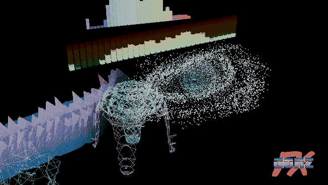

# Audio Viz

Visualizadores 3D que reaccionan al audio, sin salir de Blender.



*Cuatro presets sonando a la vez sobre el mismo tema. Renderizado con el plugin;
el GIF va sin sonido.*

Cargas una canción, el plugin la analiza ahí mismo y te deja varios presets
listos para animar: barras, LEDs, plexus, un paisaje que avanza y un enjambre de
partículas. Todo se puede tener a la vez, varias veces, cada uno escuchando un
audio distinto y con su propia configuración.

Para Blender 5.0 o superior. No necesita instalar nada más: usa el decodificador
de audio y el ffmpeg que Blender ya trae.

---

## Instalación

1. Descarga `audio_viz-1.0.0.zip` de la sección
   [Releases](../../releases).
2. En Blender: **Edit → Preferences → Add-ons**, la flecha de arriba a la
   derecha → **Install from Disk…**, elige el zip.
3. Marca la casilla de "Audio Viz".

El panel sale en el visor 3D: tecla **N**, pestaña **Audio Viz**.

Para construir el zip tú mismo, desde la carpeta `extension/audio_viz`:

```
blender --factory-startup --command extension build --output-dir ../../dist
```

---

## Cómo funciona

Cargas un audio y el plugin lo analiza en bandas logarítmicas (8 por defecto,
configurables), guarda los valores **en crudo** dentro de un Empty de la escena
y genera curvas de animación a partir de ellos.

Que los valores crudos se guarden aparte es lo que hace que el suavizado —el
ataque y la caída— se pueda tocar en cualquier momento sin volver a analizar
nada. Mueves un deslizador y las curvas se rehacen al instante.

El tempo se detecta solo al cargar. Junto al BPM verás su respaldo: *"5 de 6
trozos del tema coinciden"*, que es literalmente lo que se ha comprobado. Si el
tema no tiene un pulso claro, no se inventa uno.

### Los presets

| Preset | Qué es |
|---|---|
| **Barras** | El ecualizador clásico. Va con drivers, así que no necesita el plugin para reproducirse. |
| **LEDs** | Columnas de cubos sueltos que se encienden de abajo arriba, de verde a rojo. |
| **Compás en cubos** | Un cubo por tiempo del compás, que crece y se enciende en su golpe. |
| **Plexus** | Nube de puntos unidos por líneas. Se puede generar desde la superficie o el volumen de cualquier modelo de la escena, y sacar las caras a un objeto aparte. |
| **Paisaje** | Una rejilla donde un eje son las frecuencias y el otro es el tiempo: el relieve avanza hacia el horizonte. |
| **Enjambre orbital** | Miles de partículas girando alrededor de un centro, empujadas y encendidas por su banda. |

### Lo que tienen en común

- **Varios a la vez.** La configuración vive en cada objeto, no en la escena, así
  que puedes tener tres plexus distintos escuchando tres canciones distintas.
- **Se puede arrastrar la barra de tiempo.** Ningún preset depende del fotograma
  anterior: el 4000 se calcula sin haber pasado por el 3999.
- **Estéreo** opcional, si el archivo lo es.
- **Botón de Hornear**, que deja una copia con la animación metida en claves de
  forma. Esa copia funciona sin el plugin instalado: para mandar el .blend a una
  granja de render o a alguien que no lo tenga.
- **Atributos para tu propio material**: `av_nivel` (dónde cae en el espectro),
  `av_intensidad` (cuánto suena ahora) y, en el enjambre, `av_golpe`. El panel
  lleva una chuleta con cómo leerlos.

### Ver el análisis

Un botón dibuja el tema entero como espectrograma dentro de Blender: el tiempo a
lo ancho, las bandas de grave a agudo, los pulsos del compás abajo y una línea
en el fotograma actual. Sirve para ajustar la caída mirando en vez de a ciegas.

---

## Renderizar

Para animaciones largas, hazlo desde una consola en vez de desde la ventana de
Blender:

```
blender --factory-startup --addons bl_ext.user_default.audio_viz -b "mi_escena.blend" -o "salida/####" -F PNG -a
```

Así el visor 3D no se dibuja, y con él se va toda una familia de cierres
inesperados que no tienen nada que ver con la imagen final. `--factory-startup
--addons …` activa solo este plugin, así que ningún otro addon puede estorbar:
comprobado midiendo píxel a píxel, la imagen sale idéntica.

PNG numerados en vez de vídeo a propósito: si se corta, no pierdes lo hecho.

---

## Qué hay en el repositorio

La interfaz está en inglés, y el castellano va registrado como traducción: si
tienes Blender en español, el panel te sale en español sin hacer nada.

```
extension/audio_viz/
  blender_audio_viz.py     todo el código
  traducciones.py          el panel en castellano
  blender_manifest.toml    nombre, versión, licencia
  __init__.py              enganche con Blender

COMO INSTALAR.txt          manual largo, en castellano
README.md                  esto
LICENSE                    GPL-3.0-or-later
```

El plugin es un solo archivo de Python. No necesita nada de fuera: usa el
decodificador de audio y el ffmpeg que Blender ya trae.

### El analizador de fuera (opcional)

En [Releases](../../releases) hay además un `Analizador de audio.exe`: un
programita con ventana, independiente de Blender, que analiza un audio y deja el
resultado en un `.json` que el plugin puede importar.

**No hace falta para nada del trabajo normal** —Blender analiza el audio él
solo—, pero sirve para procesar muchos temas de golpe, para guardar un análisis y
reutilizarlo sin repetirlo, o para pasarle a alguien el análisis sin pasarle el
audio.

Va acompañado de `analizador-fuente-1.0.0.zip` con su código, porque la licencia
es GPL y el fuente tiene que viajar con el binario. Y porque un `.exe` sin firmar
que descargas de internet merece que puedas mirar qué hace.

---

## Estado

Funciona y está en uso. Lo que sé que falta o cojea:

- La detección de tempo acierta en música con pulso claro, pero se equivoca
  cuando el tempo respira (grabaciones en directo, cosas tocadas a mano). En esos
  casos se puede escribir el BPM a mano y todo lo demás funciona igual.
- El plexus y el paisaje rehacen su geometría en cada fotograma, así que con
  muchos puntos la reproducción en el visor se resiente. El botón de Hornear
  resuelve esto para el render final.

---

## Licencia

GPL-3.0-or-later, como corresponde a un addon de Blender. El texto completo está
en [LICENSE](LICENSE).
